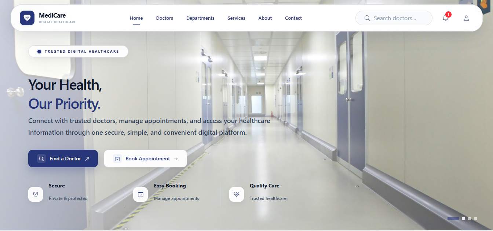
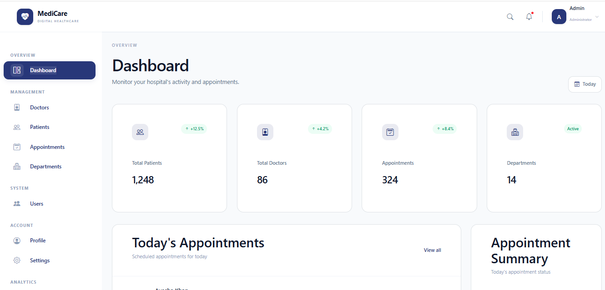
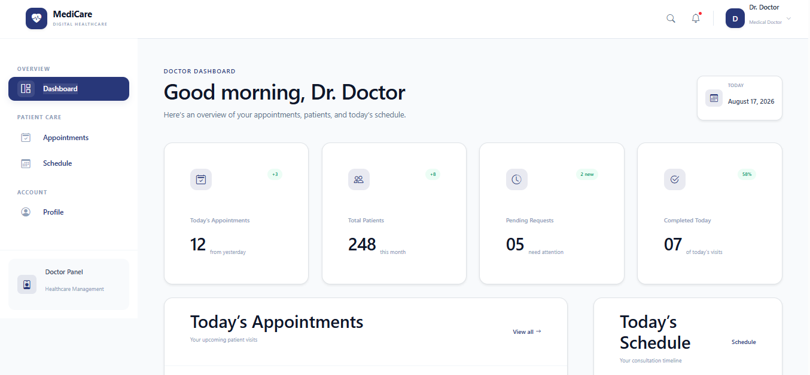
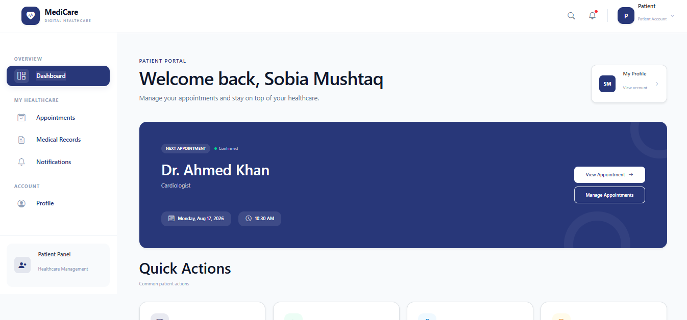
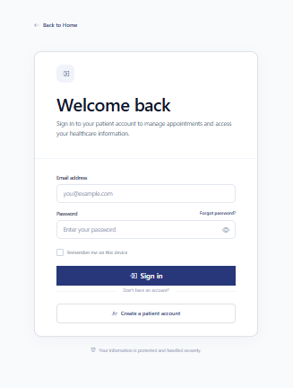
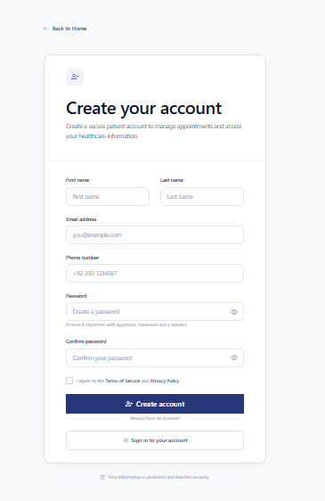
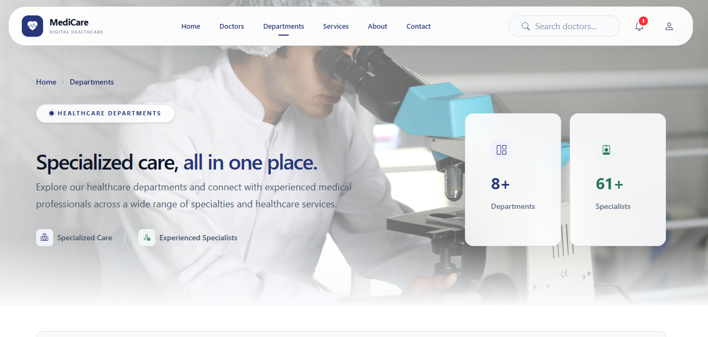
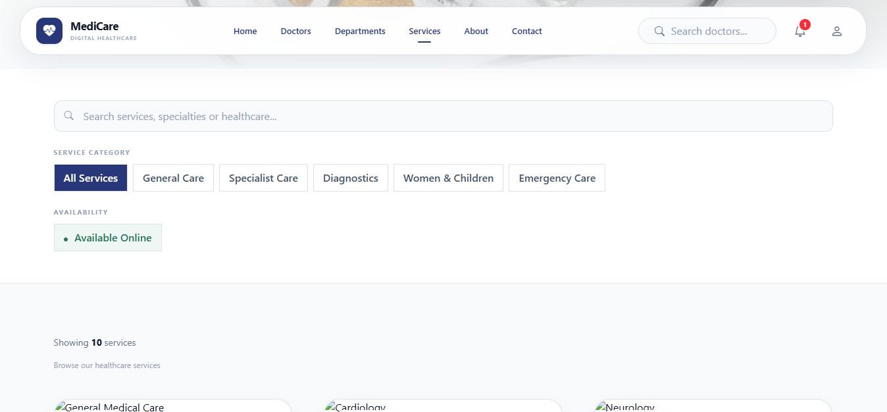
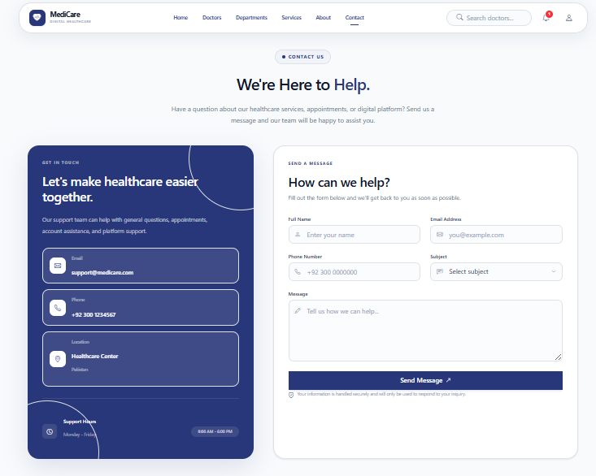

# Medicare_AI
  Healthcare Management System

A modern and responsive Healthcare Management System built with Angular and Tailwind CSS.

Live Demo: https://dhms-zeta.vercel.app/
## Features

- Admin Dashboard
- Doctor Dashboard
- Patient Dashboard
- Appointment Management
- Doctor & Patient Management
- Departments
- Medical Records
- Notifications
- Responsive Design
- Authentication

## Tech Stack

- Angular
- TypeScript
- Tailwind CSS
- Bootstrap Icons
- Django REST Framework
- MongoDB

## Screenshots

### Home



### Admin Panel



### Doctor Panel



### Patient Panel



### Login



### Signup



### Doctors


### Departments



### Services



### About


### Contact



## Getting Started

```bash
npm install
ng serve
